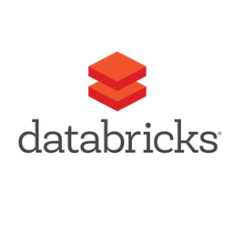

# General Use
* [Survey the services on the Azure Data platform](https://docs.microsoft.com/en-us/learn/modules/survey-the-azure-data-platform/) - MS Learn
* [Integrating Data in Microsoft Azure](https://app.pluralsight.com/library/courses/microsoft-azure-data-integrating) - Pluralsight
* [Selecting an Appropriate Data Storage Service in Microsoft Azure](https://app.pluralsight.com/library/courses/microsoft-azure-data-storage-service-selecting/table-of-contents) - Pluralsight
* [The Fundamentals of Scaling Agile](https://app.pluralsight.com/library/courses/fundamentals-scaling-agile/table-of-contents) - Pluralsight
* [DataFrames and Datasets](https://docs.microsoft.com/en-us/azure/databricks/spark/latest/dataframes-datasets/) - MS Learn

 

# Data Factory Resources
## Introduction
* [Building Your First Data Pipeline in Azure Data Factory](https://app.pluralsight.com/library/courses/building-first-data-pipeline-azure-data-factory/recommended-courses) - Pluralsight

## Deep Dives
* [Modern Data Warehousing at Scale Using Azure Data Factory](https://app.pluralsight.com/library/courses/big-data-ldn-session-25) - Pluralsight
* [Create production workloads on Azure Databricks with Azure Data Factory](https://docs.microsoft.com/en-us/learn/modules/create-production-workloads-azure-databricks-azure-data-factory/) - MS Learn

 

<!--- 

  

-->

# DataBricks Resources
## Introduction
* [Introduction to Databricks][https://www.youtube.com/watch?v=WaxMj5_SLUI] - Youtube
* [Describe Azure Databricks](https://docs.microsoft.com/en-us/learn/modules/describe-azure-databricks/) - MS Learn
* [Implementing an Azure Databricks Environment in Microsoft Azure](https://app.pluralsight.com/library/courses/microsoft-azure-databricks-environment-implementing)  - Pluralsight
* [Describe Azure Databricks best practices](https://docs.microsoft.com/en-us/learn/modules/describe-azure-databricks-best-practices/) - MS Learn
* [Integrate Azure Databricks with other Azure services](https://docs.microsoft.com/en-us/learn/modules/integrate-azure-databricks-other-azure-services/) - MS Learn
* [Read and write data in Azure Databricks](https://docs.microsoft.com/en-us/learn/modules/read-write-data-azure-databricks/) - MS Learn

## Deep Dives
* [Describe platform architecture, security, and data protection in Azure Databricks](https://docs.microsoft.com/en-us/learn/modules/describe-platform-architecture-security-data-protection-azure-databricks/) - MS Learn
* [Data Engineering with Azure DataBricks](https://docs.microsoft.com/en-us/learn/paths/data-engineer-azure-databricks/) - MS Learn
* [Building Your First ETL Pipeline Using Azure Databricks](https://app.pluralsight.com/library/courses/building-etl-pipeline-microsoft-azure-databricks/table-of-contents) - Pluralsight
 
  
 
 

# Data Lake Resources
## Introduction
* [Introduction to Azure Data Lake Storage](https://docs.microsoft.com/en-us/learn/modules/introduction-to-azure-data-lake-storage/) - MS Learn
* [Data Processing with Azure Data Lake](https://docs.microsoft.com/en-us/learn/paths/data-processing-with-azure-adls/) - MS Learn

## Deep Dives
